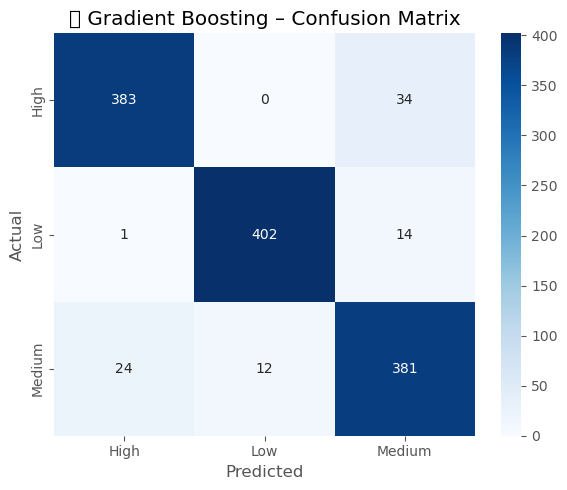

# Sales Forecasting and Demand Prediction

## Overview

This project implements a comprehensive machine learning pipeline for forecasting weekly sales and predicting demand levels for a retail chain (e.g., Walmart). It combines regression and classification tasks using a stacked ensemble approach to ensure accurate and logically consistent predictions.

Key components:

* **Exploratory Data Analysis (EDA)**
* **Data Preprocessing & Cleaning**
* **Feature Selection & Evaluation**
* **Regression Modeling** (Weekly Sales Forecast)
* **Classification Modeling** (Demand Level Prediction)
* **Stacked Modeling** (Meta-Learning Ensemble)
* **Deployment** using Docker and Streamlit

---

## Project Structure

```
├── Data/                           # Directory containing all raw and processed data
│   └── walmart-sales-dataset-of-45stores.csv  # Original dataset containing historical sales data
│
├── Docker/                         # Docker configuration files
│   └── Dockerfile                  # Contains instructions for building the Docker container image
│
├── Models/                         # Contains serialized machine learning models
│   ├── xgboost_sales_forecast_model.pkl        # XGBoost regression model for weekly sales forecasting
│   ├── gradient_boosting_demand_classifier.pkl # Gradient Boosting model for demand level classification
│   └── meta_demand_classifier.pkl             # Final stacked ensemble model for demand prediction
│
├── StreamlitApp/                   # Streamlit application components
│   └── walmart2.py                 # Main Streamlit application file
│
├── images/                         # Visualization outputs and application screenshots
│   ├── Sales_forcasting_streamlit.png         # Screenshot of the Streamlit app interface
│   ├── Gradient_classifier_cm_output.png     # Confusion matrix for Gradient Boosting classifier
│   ├── XGBoost_eva_output.png                # Evaluation plots for XGBoost regressor
│   ├── sales_Bystore_plot.png                # Sales distribution across stores
│   ├── trends_output.png                     # Time series trends of sales data
│   └── corr_output.png                       # Correlation matrix of features
│
├── last_version_Walmart.ipynb      # Jupyter notebook containing the complete workflow
│
└── requirements.txt                # Python dependencies file
```

---

## Setup

1. Clone this repository:

   ```bash
   git clone https://github.com/Moustafa29/Sales-forecasting-and-demand-prediction.git
   cd Sales-forecasting-and-demand-prediction
   ```

2. Install dependencies:

   ```bash
   pip install -r requirements.txt
   ```

3. Run the Streamlit App:

   ```bash
   streamlit run StreamlitApp/walmart2.py
   ```

4. (Optional) Docker Deployment:

   ```bash
   cd Docker
   docker build -t sales_app .
   docker run -p 8501:8501 sales_app
   ```

---

## Exploratory Data Analysis (EDA)

* Performed initial data exploration to understand distributions, trends, and relationships.
* Visualized key features such as temperature, fuel price, unemployment, CPI, and weekly sales.
* Identified seasonal patterns, outliers, and potential correlations to guide feature engineering.

---

## Data Preprocessing & Feature Engineering

* **Date Parsing:** Converted `Date` to datetime and extracted `Day`, `Month`, `Year`, `DayOfWeek`, `IsWeekend`.
* **Lag Features:** Engineered `Sales_Lag_1` and `RollingMean_4`.
* **Season Flags:** One-hot encoded seasons (`Season_Spring`, `Season_Summer`, `Season_Winter`).
* **Cleaning:** Handled missing values and outliers identified via histograms and boxplots.

## Feature Summary

* **Store (ID)**
* **Holiday\_Flag**
* **Temperature, Fuel\_Price, CPI, Unemployment**
* **Month, DayOfWeek, IsWeekend**
* **Sales\_Lag\_1, RollingMean\_4**
* **Season\_Spring, Season\_Summer, Season\_Winter**

---

## Visualizations

**Correlation Matrix:**


**Seasonal Trends:**


---

## Modeling

### Regression Model (Weekly Sales)

* **Models Evaluated:** Random Forest, Gradient Boosting, XGBoost
* **Best Model:** XGBoost Regressor
* **Performance:**

  * MAE: \~\$83,957
  * RMSE: \~\$133,981


### Classification Model (Demand Level)

* **Classes:** Low, Medium, High (based on sales quantiles)
* **Models Evaluated:** Random Forest, XGBoost Classifier, Gradient Boosting
* **Best Model:** Gradient Boosting Classifier
* **Performance:**

  * Accuracy: \~94%
  * Macro F1-Score: \~0.94



---

## Stacked Modeling (Meta-Learning Ensemble)

1. **Base Models:**

   * XGBoost Regressor → `sales_pred`
   * Gradient Boosting Classifier → `demand_pred`
2. **Meta Features:**

   * Original 13 features
   * `sales_pred`, `demand_pred`, `sales_bucket` (Low/Med/High by quantiles)
3. **Meta-Model:**

   * Gradient Boosting Classifier trained on stacked features
   * Final demand prediction adjusted for consistency

**Performance:**

* Accuracy: \~97%
* Macro F1-Score: \~0.97


---

## Inference & Deployment

### Streamlit App

Interactive UI to enter feature values and receive:

* Predicted weekly sales
* Final corrected demand level


### Docker Configuration

Dockerfile (in `Docker/`):

```dockerfile
# Use a Python base image
FROM python:3.9-slim

# Set working directory in the container
WORKDIR /app

# Copy everything into the container
COPY . .

# Install required packages
RUN pip install --no-cache-dir -r requirements.txt

# Expose Streamlit port
EXPOSE 8501

# Run the Streamlit app
CMD ["streamlit", "run", "walmart2.py"]
```

---

## Next Steps

* Automate data ingestion and model retraining
* Monitor performance and drift in production
* Expand to new stores and longer forecast horizons

---

## License

MIT License
